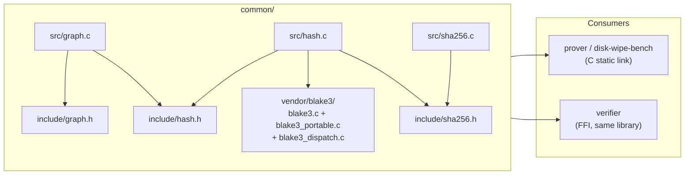
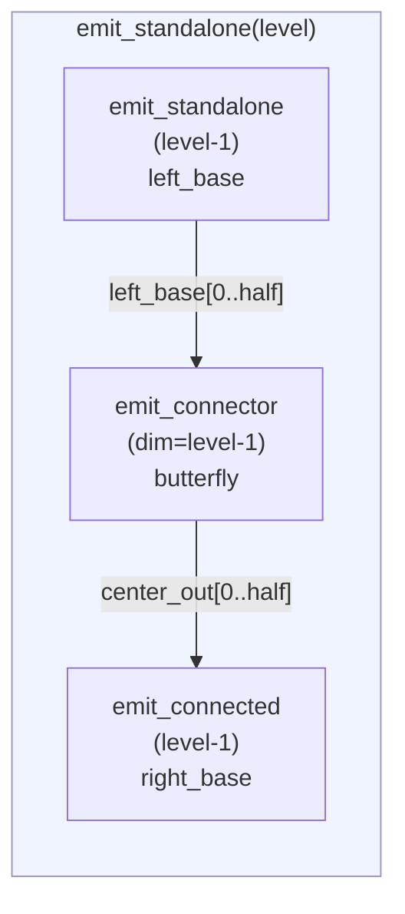
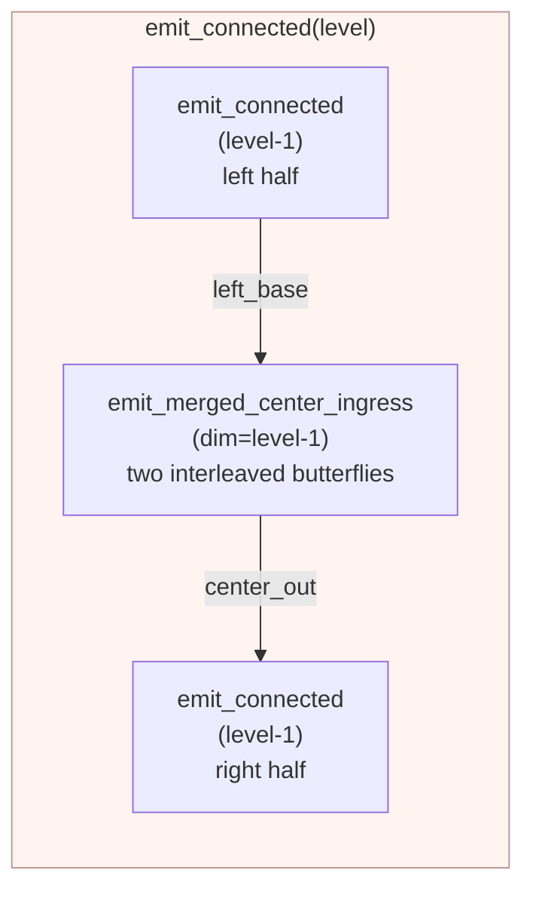
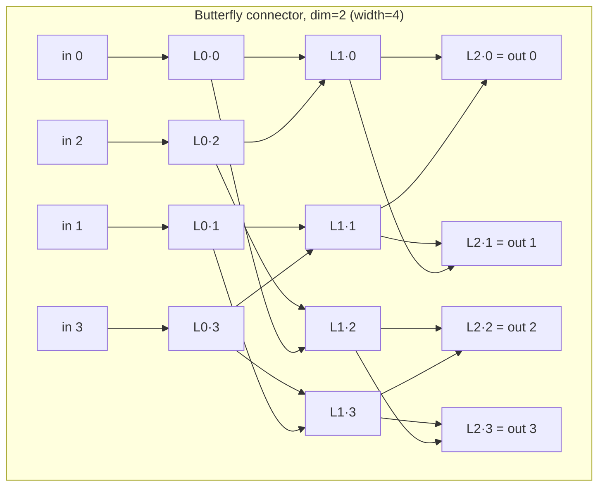

# Common Library — Graph Labeling & Hash Primitive

`common/` is the single implementation of the PoSE-DB graph algorithm and hash primitive. In the full system it is shared between the prover (the device being wiped) and the verifier; in this repository it is consumed by the CUDA labeler (`src/cuda/`) and `tools/disk-wipe-bench`. Correctness here determines correctness of the entire proof.

This document describes the CPU library. The GPU labeler is documented in the headers of `common/src/cuda/label_gpu_*.cu` and `common/include/gpu_label.h`.

## Module Structure



## Hash Primitive

`hash.c` dispatches between two hash algorithms based on the `pose_hash_algo_t` enum passed at runtime. The enum is declared in `include/hash.h` and threaded through every labeling call:

```c
typedef enum {
    POSE_HASH_BLAKE3 = 0,   /* default */
    POSE_HASH_SHA256 = 1,   /* ARMv8 SHA-2 hardware acceleration path */
} pose_hash_algo_t;
```

The `algo` value is part of the session plan agreed between prover and verifier. Both sides must use the same algorithm for a session or challenge verification will fail. The GPU labeler implements keyed BLAKE3 only.

### BLAKE3 (default)

`hash.c` uses BLAKE3 in **key-derivation mode** (`blake3_hasher_init_derive_key`). The context string acts as a domain separator — each label type produces outputs that are cryptographically independent even if all other inputs are identical.

The key performance path uses `blake3_hash_many` which hashes up to 4 independent 192-byte messages in a single NEON-vectorised call on ARM64. This 4-wide batching is what makes BLAKE3 fast for graph labeling: each call to `pose_label_node_many(n=4, ...)` invokes `blake3_hash_many` once, processing all four messages simultaneously.

BLAKE3 vendor sources are compiled with `BLAKE3_USE_NEON=1` (ARM64 NEON), with all x86 SIMD paths disabled (`BLAKE3_NO_AVX512`, `BLAKE3_NO_AVX2`, `BLAKE3_NO_SSE41`, `BLAKE3_NO_SSE2`).

### SHA-256 (benchmarking path)

`sha256.c` provides a SHA-256 implementation for comparison against BLAKE3. The motivation is benchmarking the ARMv8 hardware SHA-2 extension (`sha256h`, `sha256h2`, `sha256su0`, `sha256su1`) against BLAKE3's NEON batching.

**Two implementations behind a compile-time guard:**
- `#ifdef __ARM_FEATURE_SHA2`: uses `vsha256hq_u32`, `vsha256h2q_u32`, `vsha256su0q_u32`, `vsha256su1q_u32` NEON intrinsics. Processes one 64-byte SHA-256 block per call using hardware instructions.
- Fallback: portable C — standard `CH`/`MAJ`/`Σ₀`/`Σ₁`/`σ₀`/`σ₁` operations.

`sha256.c` is compiled with `-march=armv8-a+sha2` so the intrinsics are available without raising the march for the rest of the build.

**Key architectural difference from BLAKE3:** there is no hardware SHA-256 equivalent to `blake3_hash_many`. The SHA-256 data-dependent message schedule prevents simple 4-lane inter-message SIMD without custom interleaved intrinsic code. The SHA-256 path therefore makes `n` sequential single-message calls in `pose_label_node_many`, versus BLAKE3's single 4-wide call. Whether ARMv8 SHA-2 speed per message compensates for the loss of 4× batching is the empirical question this path answers.

**The SHA-256 path has no domain-separated keying** — it hashes the raw 192-byte node message. This is correct for a throughput benchmark but means SHA-256 labels cannot be cross-checked against an independent keyed scheme. Do not use `POSE_HASH_SHA256` in a production proof record.

### Node Message Layout

All calls share a fixed 192-byte message structure (3 × 64-byte blocks), compatible with both BLAKE3's 64-byte block length and SHA-256's 64-byte block size:

```
Block 0 [  0.. 63]:  node_index (8 B big-endian) | zeros (56 B)
Block 1 [ 64..127]:  pred0 (32 B) | pred1 (32 B)  — zero if absent
Block 2 [128..191]:  seed (32 B) | descriptor (32 B)
```

For BLAKE3, this message is keyed with:
- source nodes: context `"pose-db/label/src"`
- internal nodes: context `"pose-db/label/int"`

For SHA-256, no keying is applied — the message is hashed directly.

| Infrastructure function | Algorithm | Notes |
|---|---|---|
| `pose_graph_descriptor` | BLAKE3 always | Context `"pose-db/descriptor"` — infrastructure, not hot path |
| `pose_chunk_seed` | BLAKE3 always | Context `"pose-db/chunk-seed"` — infrastructure, not hot path |

The graph descriptor binds each label to a specific `(m, n, label_width_bits)` triple, preventing cross-session label reuse.

## Graph Algorithm — pose-db-drg-v1

The graph family is a **depth-robust DAG** (Directed Acyclic Graph). Depth-robustness is the property that after removing any small subset of nodes, the remaining graph still has long paths. This property forces the prover to hold all labels in memory simultaneously — they cannot stream the computation or recompute on demand within the RTT budget.

### Parameter Derivation

Given `m` (number of output blocks), compute:

```
n     = max(0, bit_length(m - 1) - 1)   — smallest n such that 2^(n+1) >= m
level = n + 1
```

The graph `G` is **two standalone copies of `G_level`**. The challenge set has exactly `m` nodes:
- `2^n` nodes from the second half of the left copy's base nodes
- `m - 2^n` nodes from the second half of the right copy's base nodes

### Recursive Construction

`G_level` is built from three sub-components:





| Component | Description |
|---|---|
| `emit_standalone(level)` | Recursive `G_level` with no external inputs — the top-level call |
| `emit_connected(level, inputs)` | `G_level` with `2^level` external inputs feeding its left side |
| `emit_connector(dim, inputs)` | Butterfly network of dimension `dim`; `(dim+1)` layers of width `2^dim`; mixes inputs using XOR-indexed predecessors |
| `emit_merged_center_ingress(dim, primary, ingress)` | Two interleaved butterfly networks; `ingress` flows top-down, `primary` merges with its output at layer 0 of the center butterfly |

### Butterfly Connector

A butterfly of dimension `dim` has `(dim+1)` layers, each of width `2^dim`. Nodes in layer `k > 0` have two predecessors from layer `k-1`:

```
pred_a = prev[i]
pred_b = prev[i XOR (1 << (dim - k))]
```



### Node Count Formulae

```
butterfly_node_count(dim)  = (dim + 1) * 2^dim
connected_node_count(0)    = 1
connected_node_count(k)    = 2 * C(k-1) + 2 * B(k-1)
standalone_node_count(0)   = 1
standalone_node_count(k)   = S(k-1) + B(k-1) + C(k-1)

total_nodes = 2 * standalone_node_count(n + 1)
```

These formulae are used to compute buffer sizes without traversing the graph.

### Formula-Driven Emitter

The implementation uses a **topological emitter** — no explicit edge table is stored. Nodes are emitted in topological order and each node's label is computed immediately from already-computed predecessor labels. The emitter state is:

```c
typedef struct {
    uint64_t         next_id;   // monotonically increasing node counter
    uint8_t         *labels;    // labels[node_id * 32]
    const uint8_t   *seed;
    size_t           seed_len;
    uint8_t          desc[32];  // graph descriptor digest
    pose_hash_algo_t algo;      // hash algorithm for this chunk
} emitter_t;
```

`algo` is set once when `do_label` initialises the emitter and is forwarded unchanged to every `pose_label_node` and `pose_label_node_many` call within the chunk. The per-chunk thread argument (`chunk_arg_t`) also carries `algo` so the thread pool workers use the same algorithm as the calling thread.

The `algo` field is specific to this implementation; the traversal itself follows the construction in the PoSE-DB paper.

### Challenge Set Extraction

```
left copy:   challenge nodes = left_base[2^n  ..  2^(n+1) - 1]
right copy:  challenge nodes = right_base[2^n  ..  2^n + (m - 2^n) - 1]

output[0 .. 2^n - 1]       = labels at left challenge nodes
output[2^n .. m - 1]       = labels at right challenge nodes
```

In the **faithful in-place path** only the `m = chunk_blocks` output-set labels `O(G)` are persisted to physical memory — one super-chunk holds the `m` outputs in challenge-rank order, nothing else. The full scaffold (`scratch_node_count(m)` nodes) is computed transiently in bounded per-thread scratch and discarded, so it never reaches physical memory. This is the security fix: the paper's soundness bound (Corollary 2) holds only for `O(G)`; internal scaffold nodes are shallow and prove nothing, so persisting them inflated the *written* fraction without raising the *attested* fraction. Persisting only `O(G)` makes **attested_fraction = 1.0** — every persisted byte is a challengeable output label.

Because persisted slot `r` is exactly output rank `r`, `pose_graph_challenge_node_ids(m, node_ids_out, scratch)` returns the **identity** mapping (`node_ids[r] = r`). Challenge lookup collapses to:

```
phys_byte = super_chunk_base + (challenge_rank % chunk_blocks) * POSE_HASH_BYTES
```

Cost: the scaffold is still *hashed* transiently, so the labeler does `scratch_node_count(m)/m` ≈ 100–400× more hash work than the persisted outputs alone (≈ 384× at `chunk_blocks = 2^20`). Wipe time rises proportionally — the accepted price of full attestation.

## Public API

Every labeling function takes a `pose_hash_algo_t algo` as its last parameter. Pass `POSE_HASH_BLAKE3` for normal operation; pass `POSE_HASH_SHA256` to use the ARMv8 hardware SHA-2 path.

```c
typedef enum {
    POSE_HASH_BLAKE3 = 0,
    POSE_HASH_SHA256 = 1,
} pose_hash_algo_t;

// Compute graph parameter n from m
int pose_graph_parameter_n(uint64_t m);

// Label m blocks — prover use
// out: m * POSE_HASH_BYTES bytes, caller allocates
int pose_graph_label(const uint8_t *seed, size_t seed_len,
                     uint64_t m, uint8_t *out,
                     pose_hash_algo_t algo);

// Recompute one challenge label — verifier use
int pose_graph_challenge(const uint8_t *seed, size_t seed_len,
                         uint64_t m, uint64_t challenge_idx,
                         uint8_t out[POSE_HASH_BYTES],
                         pose_hash_algo_t algo);

// Label a contiguous memory region (allocates scratch per thread internally)
int pose_graph_label_region(const uint8_t *session_seed, size_t seed_len,
                             void *region, size_t region_len,
                             uint64_t region_block_offset,
                             pose_hash_algo_t algo);

// Same but with caller-supplied scratch buffers (used by the prover after pool creation)
int pose_graph_label_region_ex(const uint8_t *session_seed, size_t seed_len,
                                void *region, size_t region_len,
                                uint64_t region_block_offset,
                                uint8_t *scratch[POSE_REGION_THREADS],
                                pose_hash_algo_t algo);

// Same but dispatches to a pre-created thread pool (non-inplace production path)
int pose_graph_label_region_pooled(const uint8_t *session_seed, size_t seed_len,
                                    void *region, size_t region_len,
                                    uint64_t region_block_offset,
                                    uint8_t *scratch[POSE_REGION_THREADS],
                                    pose_graph_pool_t *pool,
                                    pose_hash_algo_t algo,
                                    uint32_t chunk_blocks);

// ── In-place API (faithful labeling; what the GPU path reproduces) ──────

// Per-thread scratch size for the faithful in-place path (bounded; holds the
// transient scaffold working set, never proportional to total RAM)
size_t pose_graph_scratch_bytes_inplace(uint32_t chunk_blocks);

// Physical blocks per super-chunk = chunk_blocks (only the output set O(G) is
// persisted, so the super-chunk is exactly chunk_blocks * POSE_HASH_BYTES bytes).
uint64_t pose_graph_super_chunk_blocks(uint32_t chunk_blocks);

// Transient scaffold node count per super-chunk (= scratch_node_count(chunk_blocks)).
// NOT persisted — used by the GPU host to size the reusable HBM work buffer.
uint64_t pose_graph_scaffold_node_count(uint32_t chunk_blocks);

// Fill node_ids_out[0..chunk_blocks-1] with challenge-node IDs (seed-independent).
// In the faithful path this is the IDENTITY (node_ids[r] = r): persisted slot r is
// output rank r.  scratch must be pose_graph_scratch_bytes_inplace(chunk_blocks) bytes.
void pose_graph_challenge_node_ids(uint32_t chunk_blocks,
                                    uint64_t *node_ids_out, uint8_t *scratch);

// Faithful in-place variant: computes the full scaffold transiently in scratch but
// persists ONLY the chunk_blocks output-set labels O(G) into physical memory, in
// challenge-rank order.  region_len must be a multiple of
// (pose_graph_super_chunk_blocks(chunk_blocks) * POSE_HASH_BYTES) = chunk_blocks*32.
int pose_graph_label_region_pooled_inplace(
        const uint8_t *session_seed, size_t seed_len,
        void *region, size_t region_len,
        uint64_t region_block_offset,
        uint8_t *scratch[POSE_REGION_THREADS],
        pose_graph_pool_t *pool,
        pose_hash_algo_t algo,
        uint32_t chunk_blocks);
```

Infrastructure functions (`pose_graph_descriptor`, `pose_chunk_seed`) always use BLAKE3 — they are called once at session setup, not in the hot labeling loop, and do not take an `algo` parameter.

## Memory Model: Full-Scratch vs In-Place

`pose_graph_label` (the full-scratch test path) allocates `2 * standalone_node_count(n+1) * 32` bytes of scratch — the full label buffer for both graph copies. Fine for host testing; infeasible for production (labeling all DRAM would require a scratch buffer larger than DRAM itself).

The faithful in-place path (`pose_graph_label_region_pooled_inplace`) computes the full scaffold transiently in bounded per-thread scratch but persists **only the `chunk_blocks` output-set labels `O(G)`** into physical memory, in challenge-rank order. Each physical **super-chunk** is exactly `chunk_blocks × 32` bytes (not `scratch_node_count × 32`), and 100% of it is attested. Per-thread heap scratch holds only base arrays + the transient scaffold working set:

| Path | Heap scratch / thread | Persisted / super-chunk | Attested fraction | Max m |
|---|---|---|---|---|
| `pose_graph_label` | `2 × S(n+1) × 32` ≈ 17 MB | `m × 32` (out only) | — | `2^20` blocks |
| `pose_graph_label_region_pooled` | `2 × S(n+1) × 32` ≈ 17 MB | `m × 32` (out only) | 1.0 | Unlimited (streaming) |
| `pose_graph_label_region_pooled_inplace` | bases + arenas (bounded) | `chunk_blocks × 32` (`O(G)`) | **1.0** | Unlimited (in-place) |

The faithful in-place path is what the prover uses for RAM sessions and what the GPU labeler reproduces byte-for-byte. The verifier's `pose_graph_challenge` uses the full-scratch path. Persisting scaffold nodes instead would write the same number of bytes but leave most of them unchallengeable, since only `O(G)` is covered by the soundness bound.

The thread count is the compile-time constant `POSE_REGION_THREADS` (default 4, overridable with `-DPOSE_REGION_THREADS=N`), so peak heap scratch scales linearly with it — even 192 threads on the in-place path is ≈ 110 MB, trivial against the RAM being wiped.

## Building

```bash
# CPU library + tests (any host with a C11 compiler):
cmake -S common -B common/build
cmake --build common/build
ctest --test-dir common/build

# CPU library + CUDA labeler (needs nvcc):
cmake -S common -B common/build-gpu -DTARGET_GPU=ON -DPOSE_CUDA_ARCH=90 -DPOSE_GPU_LABEL_STRATEGY=warp
cmake --build common/build-gpu
```

## Benchmarking BLAKE3 vs SHA-256

The `bench_region` binary (built as part of `common/`) runs the full labeling pipeline for a configurable number of 128 KB chunks and reports throughput. It always uses `POSE_HASH_BLAKE3`. To compare against SHA-256, modify the `algo` argument passed to `pose_graph_label_region` in `bench/bench_region.c`, rebuild, and run both.


