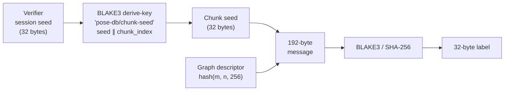
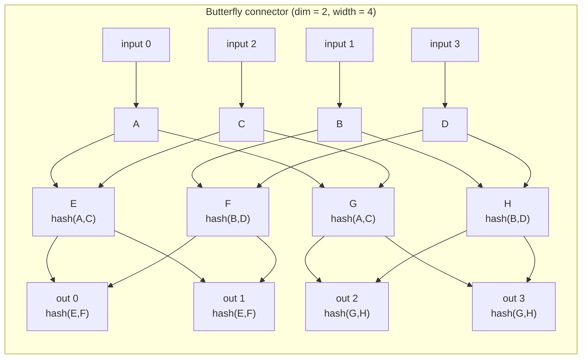
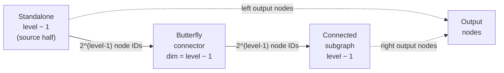
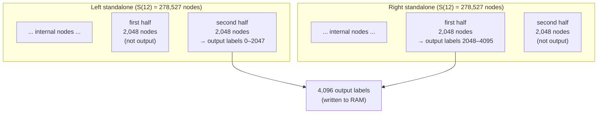
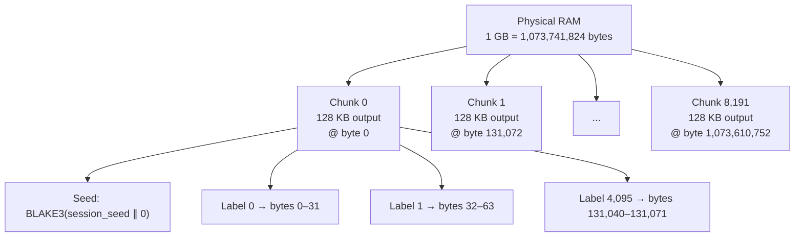
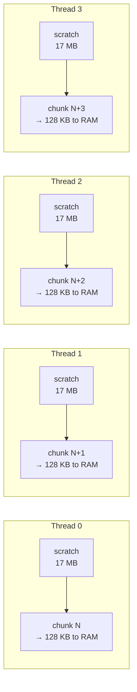

# PoSE-DB Labeling: How It Works

This document explains in plain terms what a label is, how many are needed to cover a target (RAM, GPU HBM or a disk), how each one is computed, and how the graph structure that governs the process maps onto the target's address space. It is written in terms of RAM; a disk is identical with "physical byte offset" read as "byte offset from sector 0".

---

## 1. What Is a Label?

A label is a **32-byte (256-bit) cryptographic hash** — the output of one BLAKE3 or SHA-256 call.

When the prover labels RAM, it writes one 32-byte label to each 32-byte block of physical memory. Writing a label **is** the erasure: the pseudorandom hash value overwrites whatever data was there before.

---

## 2. How Many Labels Cover 1 GB?

```
1 GB = 1,073,741,824 bytes
1 label = 32 bytes
Labels needed = 1,073,741,824 ÷ 32 = 33,554,432  (≈ 33.5 million labels)
```

Those labels are not all computed at once. The region is processed in **chunks** of 4,096 labels (128 KB of output each):

```
1 GB ÷ 128 KB per chunk = 8,192 chunks
```

Each chunk is independent — it uses its own derived seed and can be processed in parallel with other chunks. The number of CPU threads is configurable at build time (`POSE_REGION_THREADS`, default 4).

### The scratch buffer

Computing one chunk does not just produce 4,096 labels. The graph algorithm requires computing **557,054 intermediate (scratch) labels** per chunk that are never written to RAM — they exist only to build chains of cryptographic dependency.

| Per chunk | Count | Memory |
|---|---|---|
| Output labels (written to RAM) | 4,096 | 128 KB |
| Scratch labels (intermediate only) | 557,054 | ≈ 17 MB |
| **Ratio** | **136:1** | |

The scratch buffer is constant size regardless of how large the RAM region is. A 1 GB region and a 256 GB region both use the same scratch buffer per thread — only the number of chunk iterations changes.

> **Attestation (faithful labeling).** Only the 4,096 output labels per chunk — the **output set `O(G)`** — are persisted to RAM; the 557,054 scaffold labels are computed transiently in scratch and discarded. This is deliberate: the PoSE-DB soundness bound (paper Corollary 2) holds **only** for `O(G)`. Internal scaffold nodes sit at shallow graph depth, so a relay adversary could recompute them within the RTT window — challenging them proves nothing. Persisting only `O(G)` means **every persisted byte is a challengeable output label → attested_fraction = 1.0**. The cost is that the labeler still *hashes* the full scaffold transiently — ≈ 136× more hashing than the persisted outputs at the default chunk size (≈ 384× at `chunk_blocks = 2^20`), so wipe time scales with the scaffold, not the persisted bytes.

---

## 3. How Each Label Is Created

Every label is the hash of a **192-byte input message** assembled from four components:

```
┌─────────────────────────────────────── 192 bytes ──────────────────────────────────────┐
│                                                                                         │
│  Block 0 (64 bytes)           Block 1 (64 bytes)           Block 2 (64 bytes)          │
│  ┌──────────┬──────────────┐  ┌──────────────┬──────────┐  ┌──────────────┬──────────┐ │
│  │ node_idx │  56 × 0x00   │  │  predecessor │   pred   │  │    seed      │  graph   │ │
│  │  8 bytes │  (padding)   │  │   label 0    │  label 1 │  │  (32 bytes)  │  desc.   │ │
│  │ big-end  │              │  │  (32 bytes)  │ (32 bytes│  │              │ (32 bytes│ │
│  │          │              │  │   or zeros)  │  or zeros│  │              │          │ │
│  └──────────┴──────────────┘  └──────────────┴──────────┘  └──────────────┴──────────┘ │
│                                                                                         │
└─────────────────────────────────────────────────────────────────────────────────────────┘
```

**What each field means:**

| Field | Size | Value | Purpose |
|---|---|---|---|
| `node_index` | 8 bytes | This node's unique ID within the chunk | Makes every label globally unique — same preds + different index → different label |
| padding | 56 bytes | All zeros | Pads Block 0 to 64 bytes (one BLAKE3 block) |
| `pred0` | 32 bytes | Label of first predecessor node, or zeros | Creates cryptographic dependency on earlier labels |
| `pred1` | 32 bytes | Label of second predecessor, or zeros | Source nodes (no predecessors) have both fields zero |
| `seed` | 32 bytes | Per-chunk session seed | Ties every label in this chunk to the verifier's secret |
| `descriptor` | 32 bytes | Hash of (m, n, 256) | Encodes graph shape — prevents labels from one graph being reused in another |

### How the seed gets here

The verifier generates a random session seed (32 bytes). The prover derives a **per-chunk seed** from it:



Because the chunk seed embeds the chunk index, labels in chunk 0 and chunk 1 are completely different even if the graph structure is identical.

### Source vs internal nodes

A **source node** has no predecessors — Block 1 is all zeros. It is labeled purely from its index, seed, and descriptor.

An **internal node** has one or two predecessors. Its label depends on the predecessor labels, which must be computed first. This chain of dependency is what makes it hard to fake: to answer a challenge at node N, the prover must have actually computed every node on the path leading to N.

---

## 4. The Graph Structure

The graph defines **which nodes are predecessors of which**. It is not stored anywhere — it is computed on the fly from a formula as the labeling proceeds.

### Why a graph at all?

A simple flat structure (each label independent) would be easy to fake: the device could discard the labels and recompute any individual one on demand. The graph makes this infeasible: answering challenge C quickly requires having pre-computed all of C's ancestors. With 136 scratch nodes per output node and deep dependency chains, there is no shortcut.

### The building blocks

The graph is built from three components that nest recursively:

**1. Source node** — the base case. No inputs, just seed + index.

**2. Butterfly connector** — a cross-wired mixing network. Takes `2^d` input node IDs, produces `2^d` output node IDs, using `d+1` layers. In each layer, every node combines two nodes from the previous layer according to a bit-reversal pattern.



> *Each node has a unique `node_index` so even nodes that share the same pair of predecessors produce different labels.*

The cross-wiring ensures that any single input influences many outputs, and any single output depends on many inputs. This gives the depth-robust property: you cannot skip nodes.

**3. Connected subgraph** — chains butterfly connectors together with an ingress connection that feeds outputs of one level into inputs of the next, building deeper dependency chains.

### The full standalone structure

One "standalone" subgraph (the graph uses two of these) is built recursively:



The standalone at level `L` contains `S(L)` total nodes:

| Level | Nodes S(L) |
|---|---|
| 0 | 1 |
| 1 | 3 |
| 2 | 11 |
| 5 | 383 |
| 8 | 7,679 |
| 11 | 116,735 |
| **12** (used for 4,096-block chunks) | **278,527** |

For a chunk with `m = 4,096` output blocks, the algorithm builds **two standalone graphs at level 12**, giving `2 × 278,527 = 557,054` total scratch nodes.

### Which nodes become output labels?

Not all scratch nodes are output. The algorithm selects a specific subset — the **challenge set** — consisting of:

- The **second half** of the base output nodes from the left standalone
- The **first half** of the base output nodes from the right standalone

This gives exactly `m = 4,096` output labels per chunk.



---

## 5. How the Graph Maps to Physical RAM

The labels are written directly into the target physical memory region via a `/dev/mem` mapping. There is a strict correspondence between label index and physical address:

```
label i  →  physical bytes [ base + i×32 ,  base + i×32 + 32 )
```

### Region → chunks → labels → bytes



### Seed isolation between chunks

Each chunk uses an independent seed derived from the verifier's session seed and the chunk's index:

```
chunk_seed_i = BLAKE3_derive_key("pose-db/chunk-seed", session_seed ∥ uint64_be(i))
```

This means:
- Chunk 0 and Chunk 1 produce completely different labels even at the same node position
- The verifier can recompute the seed for any chunk from the session seed alone
- A challenged label at physical address `P` can be reconstructed by the verifier as: `chunk_index = (P / 32) / 4096`, derive `chunk_seed`, rerun the graph, look up the output label at position `(P / 32) % 4096`

### The parallel threads

Chunks are processed in parallel, one per CPU thread, each with its own scratch buffer. The thread count is set at build time by `POSE_REGION_THREADS` (default 4) and is printed at wipe time (`threads=N`). The diagram below shows the default of 4:



After each batch completes, the next batch begins. The scratch buffers are reused across batches — they are allocated once at startup and never freed until the entire region is labeled.

---

## Quick Reference

| Parameter | Value |
|---|---|
| Label size | 32 bytes |
| Labels needed for 1 GB | 33,554,432 |
| Labels per chunk | 4,096 |
| Chunks needed for 1 GB | 8,192 |
| Scratch nodes per chunk | 557,054 |
| Scratch-to-output ratio | 136:1 |
| Scratch memory per thread | ≈ 17 MB |
| Parallel threads | 4 (default; build-configurable via `POSE_REGION_THREADS`) |
| Input message size | 192 bytes |
| Hash algorithm | BLAKE3 (default) or SHA-256 |
